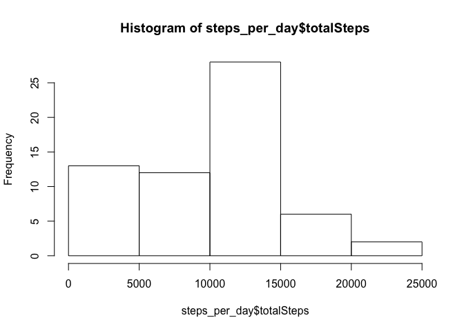
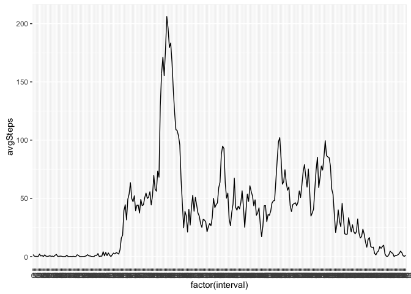
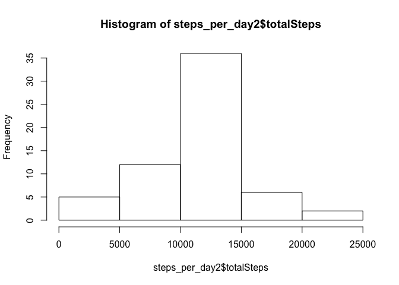
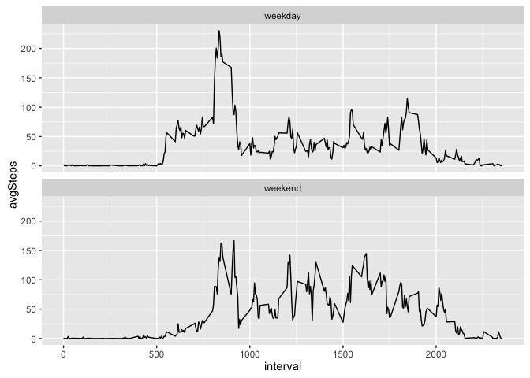

# Reproducible Research: Peer Assessment 1


## Loading and preprocessing the data

```r
library(plyr)
detach("package:plyr", unload=TRUE)
library(dplyr)
```

```
## 
## Attaching package: 'dplyr'
```

```
## The following objects are masked from 'package:stats':
## 
##     filter, lag
```

```
## The following objects are masked from 'package:base':
## 
##     intersect, setdiff, setequal, union
```

```r
library(ggplot2)
```

```
## Warning: package 'ggplot2' was built under R version 3.2.4
```

```r
library(timeDate)
library(lattice)
activity <- read.csv("activity.csv")
activity <- tbl_df(activity)
activity
```

```
## Source: local data frame [17,568 x 3]
## 
##    steps       date interval
##    (int)     (fctr)    (int)
## 1     NA 2012-10-01        0
## 2     NA 2012-10-01        5
## 3     NA 2012-10-01       10
## 4     NA 2012-10-01       15
## 5     NA 2012-10-01       20
## 6     NA 2012-10-01       25
## 7     NA 2012-10-01       30
## 8     NA 2012-10-01       35
## 9     NA 2012-10-01       40
## 10    NA 2012-10-01       45
## ..   ...        ...      ...
```
## Mean total number of steps taken per day
### total number of steps taken per day

```r
by_date = group_by(activity, date)
steps_per_day = summarize(by_date, totalSteps = sum(steps, na.rm = TRUE), avgSteps = mean(steps,na.rm = TRUE), mediSteps = median(steps, na.rm = TRUE))
steps_per_day
```

```
## Source: local data frame [61 x 4]
## 
##          date totalSteps avgSteps mediSteps
##        (fctr)      (int)    (dbl)     (dbl)
## 1  2012-10-01          0      NaN        NA
## 2  2012-10-02        126  0.43750         0
## 3  2012-10-03      11352 39.41667         0
## 4  2012-10-04      12116 42.06944         0
## 5  2012-10-05      13294 46.15972         0
## 6  2012-10-06      15420 53.54167         0
## 7  2012-10-07      11015 38.24653         0
## 8  2012-10-08          0      NaN        NA
## 9  2012-10-09      12811 44.48264         0
## 10 2012-10-10       9900 34.37500         0
## ..        ...        ...      ...       ...
```
### Histogram of the total number of steps taken each day


```r
hist(steps_per_day$totalSteps)
```

<!-- -->
### Mean and median number of steps taken each day?


```r
select(steps_per_day,date, avgSteps, mediSteps)
```

```
## Source: local data frame [61 x 3]
## 
##          date avgSteps mediSteps
##        (fctr)    (dbl)     (dbl)
## 1  2012-10-01      NaN        NA
## 2  2012-10-02  0.43750         0
## 3  2012-10-03 39.41667         0
## 4  2012-10-04 42.06944         0
## 5  2012-10-05 46.15972         0
## 6  2012-10-06 53.54167         0
## 7  2012-10-07 38.24653         0
## 8  2012-10-08      NaN        NA
## 9  2012-10-09 44.48264         0
## 10 2012-10-10 34.37500         0
## ..        ...      ...       ...
```
## Average daily activity pattern
### Time Series plot of 5 minute interval 

```r
by_interval = group_by(activity, interval)
steps_per_interval = summarize(by_interval, totalSteps = sum(steps, na.rm = TRUE), avgSteps = mean(steps,na.rm = TRUE), mediSteps = median(steps, na.rm = TRUE))
steps_per_interval
```

```
## Source: local data frame [288 x 4]
## 
##    interval totalSteps  avgSteps mediSteps
##       (int)      (int)     (dbl)     (int)
## 1         0         91 1.7169811         0
## 2         5         18 0.3396226         0
## 3        10          7 0.1320755         0
## 4        15          8 0.1509434         0
## 5        20          4 0.0754717         0
## 6        25        111 2.0943396         0
## 7        30         28 0.5283019         0
## 8        35         46 0.8679245         0
## 9        40          0 0.0000000         0
## 10       45         78 1.4716981         0
## ..      ...        ...       ...       ...
```

```r
ggplot(steps_per_interval, aes(x = factor(interval), y = avgSteps)) + geom_line(aes(group =1))
```

<!-- -->
### The interval with the maximum avg no. of Steps

835 

## Imputing missing values

### Count number of missing values


```r
count(activity[is.na(activity),])
```

```
## Source: local data frame [1 x 1]
## 
##       n
##   (int)
## 1  2304
```

### Strategy for imputting missing values
To account for missing values, i am using the average value from the same interval to populate values to the missing elemnets. To do this;

* Merge my table with missing values, with the summarized table created earlier, using interval as the intersection. This creates a new table with the original table colums plus the value of the average of each corresponding interval.
* Next I check the NAs in the steps column and replace them with the average steps column value.
*Create a new dataset that is equal to the original dataset but with the missing data filled in


```r
activity2 = tbl_df(merge(activity,steps_per_interval, by = "interval", all.x =TRUE))
activity_imputed = tbl_df(transform(activity2, steps = ifelse(is.na(activity2$steps),activity2$avgSteps,activity2$steps)))
activity_imputed = select(activity_imputed, steps, date,interval)
```

### New dataset

```r
activity_imputed
```

```
## Source: local data frame [17,568 x 3]
## 
##       steps       date interval
##       (dbl)     (fctr)    (int)
## 1  1.716981 2012-10-01        0
## 2  0.000000 2012-11-23        0
## 3  0.000000 2012-10-28        0
## 4  0.000000 2012-11-06        0
## 5  0.000000 2012-11-24        0
## 6  0.000000 2012-11-15        0
## 7  0.000000 2012-10-20        0
## 8  0.000000 2012-11-16        0
## 9  0.000000 2012-11-07        0
## 10 0.000000 2012-11-25        0
## ..      ...        ...      ...
```
### Histogram of the total number of steps taken each day and Calculate and report the mean and median total number of steps taken per day for new data set


```r
by_date2 = group_by(activity_imputed, date)
steps_per_day2 = summarize(by_date2, totalSteps = sum(steps, na.rm = TRUE), avgSteps = mean(steps,na.rm = TRUE), mediSteps = median(steps, na.rm = TRUE))
steps_per_day2
```

```
## Source: local data frame [61 x 4]
## 
##          date totalSteps avgSteps mediSteps
##        (fctr)      (dbl)    (dbl)     (dbl)
## 1  2012-10-01   10766.19 37.38260  34.11321
## 2  2012-10-02     126.00  0.43750   0.00000
## 3  2012-10-03   11352.00 39.41667   0.00000
## 4  2012-10-04   12116.00 42.06944   0.00000
## 5  2012-10-05   13294.00 46.15972   0.00000
## 6  2012-10-06   15420.00 53.54167   0.00000
## 7  2012-10-07   11015.00 38.24653   0.00000
## 8  2012-10-08   10766.19 37.38260  34.11321
## 9  2012-10-09   12811.00 44.48264   0.00000
## 10 2012-10-10    9900.00 34.37500   0.00000
## ..        ...        ...      ...       ...
```

```r
hist(steps_per_day2$totalSteps)
```

<!-- -->


## Differences in activity patterns between weekdays and weekends?

### new factor variable in the dataset with two levels – “weekday” and “weekend”


```r
activity_imputed = tbl_df(transform(activity_imputed, weekday = ifelse(isWeekday(activity_imputed$date), "weekday", "weekend")))
```

### Panel Plot


```r
by_interval_weekday = group_by(activity_imputed, interval, weekday)
steps_by_interval_weekday = summarize(by_interval_weekday, avgSteps = mean(steps))
ggplot(steps_by_interval_weekday, aes(interval, avgSteps)) + geom_line() + facet_wrap(~ weekday, ncol=1)
```

<!-- -->

